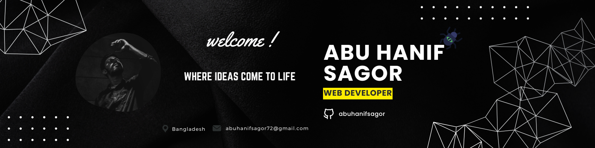

<h1 align="center">
    

</h1>

### 👨🏼‍🎓 Abu Hanif Sagor

Specializing in MERN stack development with a knack for creating scalable, maintainable, and high-performance web applications.  
Driven by curiosity, fueled by challenges, and committed to turning complex problems into elegant solutions.

### 📬 Connect & Collaborate

  
  &nbsp;&nbsp;
  
  &nbsp;&nbsp;
  

### 🛠️ Tech Stack

#### 🌐 Frontend

  

#### 🧠 Backend & Database

  
  

#### ☁️ Deployment & Hosting

  

#### 🎨 UI/UX & Tools

  

###

## 📊 GitHub Stats

<table>
  <tr>
    <td>
      
    </td>
    <td>
      
    </td>
  </tr>
  <tr>
    <td>
      
    </td>
    <td>
      
    </td>
  </tr>
</table>

 

## 💰 You can help me by Donating

###

<picture>
  <source media="(prefers-color-scheme: dark)" srcset="https://raw.githubusercontent.com/abuhanifsagor/abuhanifsagor/output/github-snake-dark.svg" />
  <source media="(prefers-color-scheme: light)" srcset="https://raw.githubusercontent.com/abuhanifsagor/abuhanifsagor/output/github-snake.svg" />
  
</picture>
